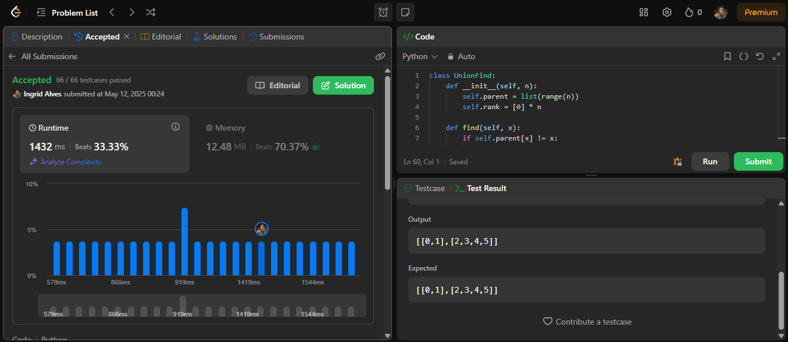
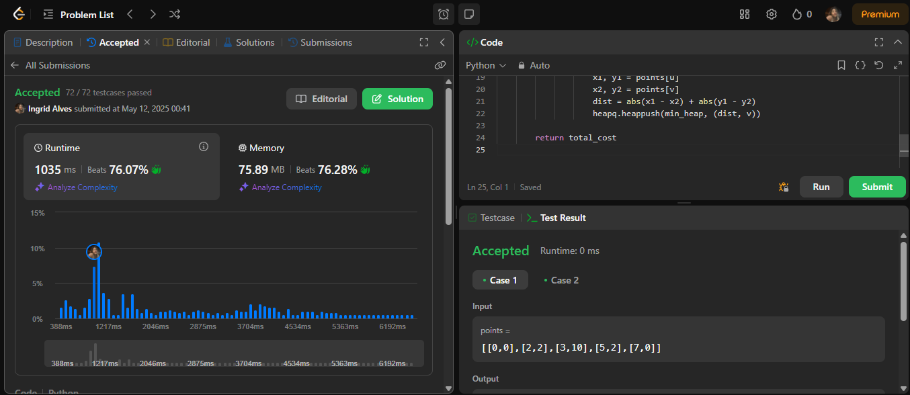

# Grafos2_Questoes_LeetCode

**Número da Lista**: 2 
**Conteúdo da Disciplina**: Grafos 2 

## Alunos
|Matrícula | Aluno |
| -- | -- |
| 22/2022000 |  Milena Fernandes Rocha |
| 20/2045348  |  Ingrid Alves Rocha |

## Sobre 
O objetivo deste projeto é treinar e aprofundar a compreensão dos algoritmos de Strongly Connected Components (SCC), Dijkstra, Prim e Kruscal estudados nas últimas semanas. Para isso, o projeto propõe a implementação prática desses algoritmos e a resolução de questões selecionadas da plataforma LeetCode, que apresentam desafios relevantes e aplicados. Essa abordagem permite reforçar o aprendizado teórico por meio da prática, além de desenvolver a capacidade de resolução de problemas em contextos variados.

## Instalação 
**Linguagem**: Python 
**Sites**: LeetCode 
 

## Screenshots

*Imagem 1: Questão 2360 aceita no LeetCode*  

**Autora:** [Milena Rocha](https://github.com/MilenaFRocha)

---

*Imagem 2: Questão 734 aceita no LeetCode*  

**Autora:** [Milena Rocha](https://github.com/MilenaFRocha)  

---

*Imagem 3: Questão 1489 aceita no LeetCode*  

**Autora:** [Ingrid Alves](https://github.com/alvesingrid)  

---

*Imagem 4: Questão 1584 aceita no LeetCode*  

**Autora:** [Ingrid Alves](https://github.com/alvesingrid) 

---

## Link do Vídeo

**Fonte:** [Milena Rocha](https://github.com/milenafrocha) e [Ingrid Alves](https://github.com/alvesingrid)  
Disponível em: [https://www.youtube.com/watch?v=DZ_3LrukvzA](https://www.youtube.com/watch?v=DZ_3LrukvzA)  
Acesso em: 21 nov. 2024.

---

### Questão 2360 - [Longest Cycle in a Graph](https://leetcode.com/problems/longest-cycle-in-a-graph/description/)

* **Solução:** [2360](./Questoes/2360.py)
* **Nível:** Hard
* **Conteúdo usado:** DFS Numbering

**Explicação:**

O **DFS Numbering** é uma técnica utilizada para explorar grafos e detectar ciclos. Durante a execução do DFS, cada nó recebe um número de visitação, o que ajuda a rastrear a ordem em que os nós são visitados.
Quando um nó é visitado, seu número de visitação é registrado. Se, ao explorar um vizinho, descobrirmos que ele já foi visitado (ou seja, seu número de visitação não é mais -1), um ciclo foi encontrado. A diferença entre o número de visitação do nó atual e o vizinho revela o tamanho do ciclo.
No código, o array `visit_id` armazena os números de visitação. O mapa `tmap` é usado para rastrear os nós visitados durante o processo de DFS, e a comparação dos números de visitação é crucial para identificar ciclos.

**Resumo:** O **DFS Numbering** permite identificar ciclos ao registrar a ordem de visitação dos nós e calcular o tamanho do ciclo com base nos números de visitação.

---

### Questão 734 - [Network Delay Time](https://leetcode.com/problems/network-delay-time/)

* **Solução:** [734](./Questoes/734.py)
* **Nível:** Medium
* **Conteúdo usado:** Dijkstra

### **Explicação:**

O **algoritmo de Dijkstra** é usado para encontrar o menor tempo necessário para enviar um sinal de um ponto inicial para todos os outros pontos em uma rede (grafo). Ele funciona explorando os caminhos mais curtos possíveis de forma organizada, garantindo que cada nó seja visitado com o menor tempo acumulado.

Durante a execução, cada nó guarda o menor tempo necessário para chegar até ele (no dicionário `distancias`). O grafo é representado por um dicionário onde cada nó aponta para seus vizinhos e o tempo de viagem até eles.

Para controlar a ordem de visita, usamos uma **fila de prioridade** (chamada `fila`), que sempre escolhe o próximo nó com o menor tempo atual. Ao visitar um nó, verificamos se ele pode levar a um caminho mais rápido para algum vizinho. Se sim, atualizamos o tempo do vizinho e colocamos ele na fila para ser processado.

Ao final, verificamos qual foi o maior tempo entre todos os nós alcançados. Esse valor representa o tempo total que o sinal levou para alcançar todos os pontos. Se algum nó ainda tiver valor infinito, significa que ele **não pode ser alcançado**, e então o resultado será `-1`.

### **Resumo:**

O **algoritmo de Dijkstra** encontra o menor tempo para alcançar todos os nós a partir de um ponto inicial, atualizando os tempos mínimos em ordem crescente com uma fila de prioridade. O maior tempo entre todos os nós visitados representa o tempo total necessário para espalhar o sinal pela rede.

---

### Questão 1489 - [Find Critical and Pseudo-Critical Edges in Minimum Spanning Tree](https://leetcode.com/problems/find-critical-and-pseudo-critical-edges-in-minimum-spanning-tree/)

* **Solução:** [1489](./Questoes/Questao_Kruscal_1489.py)  
* **Nível:** Hard  
* **Conteúdo usado:** Kruskal, Union-Find, MST com inclusão/exclusão de arestas

**Explicação:**

Essa questão exige encontrar, em uma **árvore geradora mínima (MST)**, quais arestas são:

- **Críticas**: se forem removidas, o custo da MST aumenta ou não é possível construir uma MST.
- **Pseudo-críticas**: podem estar em alguma MST válida, mas não são obrigatórias.

A estratégia consiste em:
1. Calcular o custo da MST original usando **Kruskal** com uma estrutura **Union-Find**.
2. Para cada aresta:
   - **Excluir** e verificar se o custo aumenta (ou fica impossível montar a MST) → ela é crítica.
   - **Incluir à força** e verificar se o custo continua o mesmo da MST original → ela é pseudo-crítica.

A ordenação das arestas pelo peso é essencial para garantir que o algoritmo de Kruskal funcione corretamente. O índice original de cada aresta é preservado para compor a resposta.

**Resumo:** A solução usa **Kruskal com Union-Find** para construir MSTs com e sem determinadas arestas, identificando se elas são **críticas** (necessárias) ou **pseudo-críticas** (opcionais mas válidas) com base no impacto que causam no custo total da árvore geradora mínima.

---

### Questão 1584 - [Min Cost to Connect All Points](https://leetcode.com/problems/min-cost-to-connect-all-points/)

* **Solução:** [1584](./Questoes/Questao_Prim_1584.py)  
* **Nível:** Medium  
* **Conteúdo usado:** Algoritmo de Prim, Árvore Geradora Mínima (MST), Min-Heap (Fila de Prioridade)

**Explicação:**

O objetivo é conectar todos os pontos em um plano 2D com **custo mínimo total**, onde o custo de conexão entre dois pontos é a **distância de Manhattan** entre eles:  
dist = |x1 - x2| + |y1 - y2|

Trata-se de um problema clássico de **Árvore Geradora Mínima (MST)**, resolvido com o **algoritmo de Prim**:

1. Iniciamos com um ponto arbitrário.
2. Utilizamos uma **min-heap** para escolher sempre a próxima aresta de menor custo.
3. A cada passo, conectamos o ponto mais próximo ainda não visitado.
4. Repetimos até que todos os pontos estejam conectados.

Diferente do Kruskal, o Prim **não precisa gerar todas as arestas previamente**. A distância de cada ponto aos já visitados é calculada dinamicamente.

**Resumo:** A solução aplica o **algoritmo de Prim com fila de prioridade (heap)** para construir uma **MST** conectando todos os pontos com custo mínimo, utilizando a distância de Manhattan como peso entre os nós.

---

