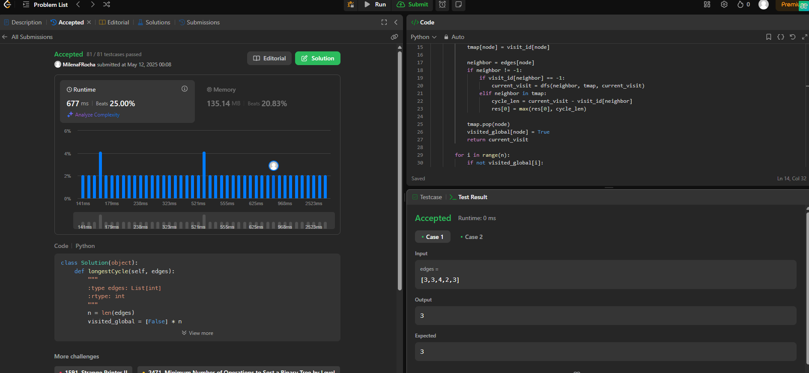

# Grafos2_Alimentos

**Número da Lista**: 2 
**Conteúdo da Disciplina**: Grafos 2 

## Alunos
|Matrícula | Aluno |
| -- | -- |
| 22/2022000 |  Milena Fernandes Rocha |
| 20/2045348  |  Ingrid Alves Rocha |

## Sobre 
O objetivo deste projeto é treinar e aprofundar a compreensão dos algoritmos de Strongly Connected Components (SCC) e Dijkstra, estudados nas últimas semanas. Para isso, o projeto propõe a implementação prática desses algoritmos e a resolução de questões selecionadas da plataforma LeetCode, que apresentam desafios relevantes e aplicados. Essa abordagem permite reforçar o aprendizado teórico por meio da prática, além de desenvolver a capacidade de resolução de problemas em contextos variados.

## Instalação 
**Linguagem**: Python 
**Sites**: LeetCode 
 

## Screenshots

  
<strong>Imagem 1: Questão 2360 aceita no LeetCode</strong>

  
  
<strong>Autora: <a href="https://github.com/MilenaFRocha" target="_blank">Milena Rocha</a></strong>

  
<strong>Imagem 2: Questão 734 aceita no LeetCode</strong>

  
  
<strong>Autora: <a href="https://github.com/MilenaFRocha" target="_blank">Milena Rocha</a></strong>

---

### Questão 2360 - [Longest Cycle in a Graph](https://leetcode.com/problems/longest-cycle-in-a-graph/description/)

* **Solução:** [2360](./Questoes/2360.py)
* **Nível:** Hard
* **Conteúdo usado:** DFS Numbering

**Explicação:**

O **DFS Numbering** é uma técnica utilizada para explorar grafos e detectar ciclos. Durante a execução do DFS, cada nó recebe um número de visitação, o que ajuda a rastrear a ordem em que os nós são visitados.
Quando um nó é visitado, seu número de visitação é registrado. Se, ao explorar um vizinho, descobrirmos que ele já foi visitado (ou seja, seu número de visitação não é mais -1), um ciclo foi encontrado. A diferença entre o número de visitação do nó atual e o vizinho revela o tamanho do ciclo.
No código, o array `visit_id` armazena os números de visitação. O mapa `tmap` é usado para rastrear os nós visitados durante o processo de DFS, e a comparação dos números de visitação é crucial para identificar ciclos.

**Resumo:** O **DFS Numbering** permite identificar ciclos ao registrar a ordem de visitação dos nós e calcular o tamanho do ciclo com base nos números de visitação.

---

### Questão 734 - [Network Delay Time](https://leetcode.com/problems/network-delay-time/)

* **Solução:** [734](./Questoes/734.py)
* **Nível:** Medium
* **Conteúdo usado:** Dijkstra

### **Explicação:**

O **algoritmo de Dijkstra** é usado para encontrar o menor tempo necessário para enviar um sinal de um ponto inicial para todos os outros pontos em uma rede (grafo). Ele funciona explorando os caminhos mais curtos possíveis de forma organizada, garantindo que cada nó seja visitado com o menor tempo acumulado.

Durante a execução, cada nó guarda o menor tempo necessário para chegar até ele (no dicionário `distancias`). O grafo é representado por um dicionário onde cada nó aponta para seus vizinhos e o tempo de viagem até eles.

Para controlar a ordem de visita, usamos uma **fila de prioridade** (chamada `fila`), que sempre escolhe o próximo nó com o menor tempo atual. Ao visitar um nó, verificamos se ele pode levar a um caminho mais rápido para algum vizinho. Se sim, atualizamos o tempo do vizinho e colocamos ele na fila para ser processado.

Ao final, verificamos qual foi o maior tempo entre todos os nós alcançados. Esse valor representa o tempo total que o sinal levou para alcançar todos os pontos. Se algum nó ainda tiver valor infinito, significa que ele **não pode ser alcançado**, e então o resultado será `-1`.

### **Resumo:**

O **algoritmo de Dijkstra** encontra o menor tempo para alcançar todos os nós a partir de um ponto inicial, atualizando os tempos mínimos em ordem crescente com uma fila de prioridade. O maior tempo entre todos os nós visitados representa o tempo total necessário para espalhar o sinal pela rede.

---

